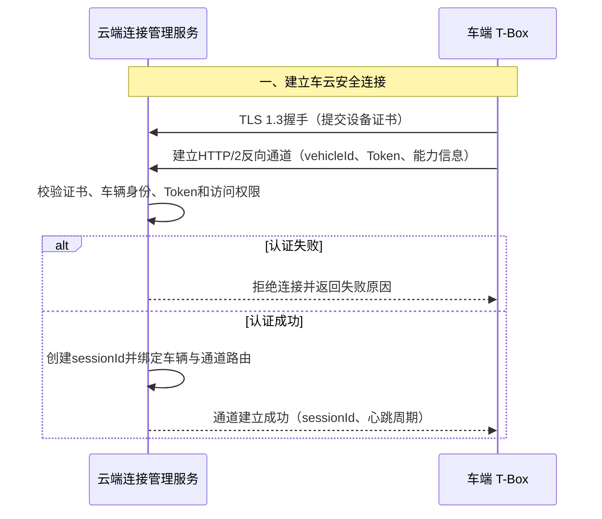
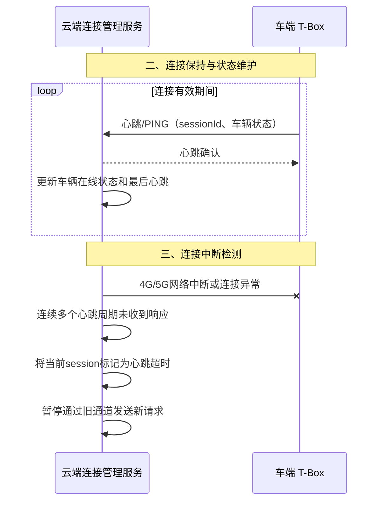
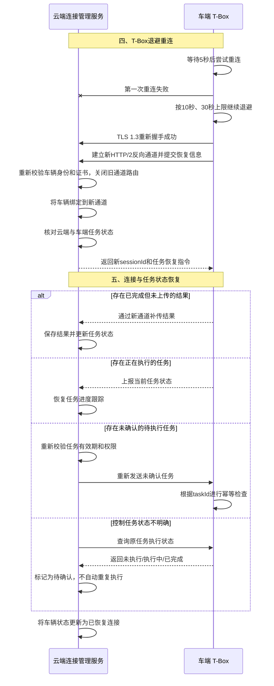

## 方案：HTTP/2 反向诊断通道

###  方案说明

- T-Box 通过 4G/5G 网络主动与云端建立 TLS 1.3＋HTTP/2 双向诊断通道。云端通过该通道转发给车端 T-Box；

- T-Box 再访问车内 SOVD Server，并通过原通道返回响应。

- T-Box 中设置 SOVD Gateway 模块，连接、转发

```mermaid
sequenceDiagram
		participant C as 云端连接管理服务
		participant T as 车端 T-Box
    
    
Note over C,T: 一、建立车云安全连接

T->>C: TLS 1.3握手（提交设备证书）
T->>C: 建立HTTP/2反向通道（vehicleId、Token、能力信息）
C->>C: 校验证书、车辆身份、Token和访问权限

alt 认证失败
    C-->>T: 拒绝连接并返回失败原因
else 认证成功
    C->>C: 创建sessionId并绑定车辆与通道路由
    C-->>T: 通道建立成功（sessionId、心跳周期）
end
```

```mermaid
sequenceDiagram
    participant C as 云端连接管理服务
		participant T as 车端 T-Box
		
    Note over C,T: 二、连接保持与状态维护

    loop 连接有效期间
        T->>C: 心跳/PING（sessionId、车辆状态）
        C-->>T: 心跳确认
        C->>C: 更新车辆在线状态和最后心跳
    end

    Note over C,T: 三、连接中断检测

    C-xT: 4G/5G网络中断或连接异常
    C->>C: 连续多个心跳周期未收到响应
    C->>C: 将当前session标记为心跳超时
    C->>C: 暂停通过旧通道发送新请求

```

    

```mermaid
sequenceDiagram
    participant C as 云端连接管理服务
		participant T as 车端 T-Box

Note over C,T: 四、T-Box退避重连

T->>T: 等待5秒后尝试重连
T-xC: 第一次重连失败
T->>T: 按10秒、30秒上限继续退避
T->>C: TLS 1.3重新握手成功
T->>C: 建立新HTTP/2反向通道并提交恢复信息

C->>C: 重新校验车辆身份和证书，关闭旧通道路由
C->>C: 将车辆绑定到新通道
C->>C: 核对云端与车端任务状态
C-->>T: 返回新sessionId和任务恢复指令

Note over C,T: 五、连接与任务状态恢复

alt 存在已完成但未上传的结果
    T-->>C: 通过新通道补传结果
    C->>C: 保存结果并更新任务状态
else 存在正在执行的任务
    T-->>C: 上报当前任务状态
    C->>C: 恢复任务进度跟踪
else 存在未确认的待执行任务
    C->>C: 重新校验任务有效期和权限
    C->>T: 重新发送未确认任务
    T->>T: 根据taskId进行幂等检查
else 控制任务状态不明确
    C->>T: 查询原任务执行状态
    T-->>C: 返回未执行/执行中/已完成
    C->>C: 标记为待确认，不自动重复执行
end

C->>C: 将车辆状态更新为已恢复连接
```
